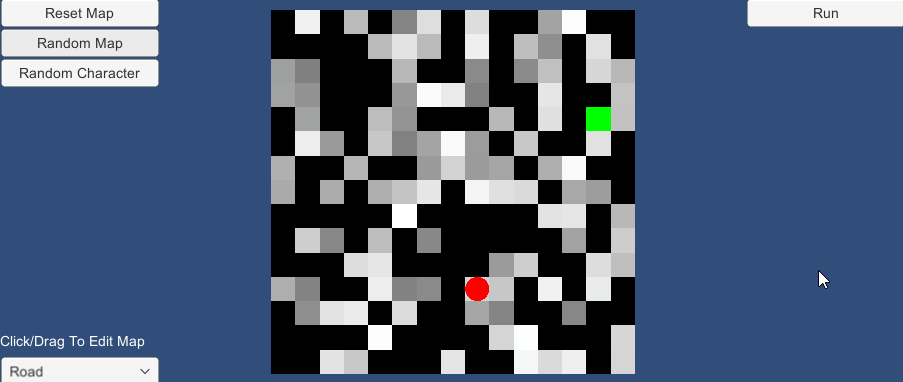

# A* Algorithm

A* algorithm implementation using Unity.

## Table of Contents
- [Features](#Features)
- [Changelog](#Changelog)

## Features
### Character

Character is an object that search/move to end point.
### End Point

The end point is a destination of character. 
### Wall

Character cannot pass through a wall.
### Road

Character can only move on the road.
The color of road shows its weight. 
The bigger the weight, the longer time it takes to move to another road and the color turns more gray.
### Map Editor

You can reset/random map, and random character's position.
Click or drag cells to edit map, scroll on a road to change its weight.

###  A* Pathfinding
If the 'Run' button is clicked, the character starts to search and move to end point. 
If there is no end point or no path, the character stops its last position.

## Changelog
### [Unreleased] - 2021-08-20
Project finished.
### [Unreleased] - 2021-08-20
Added
- README.md

